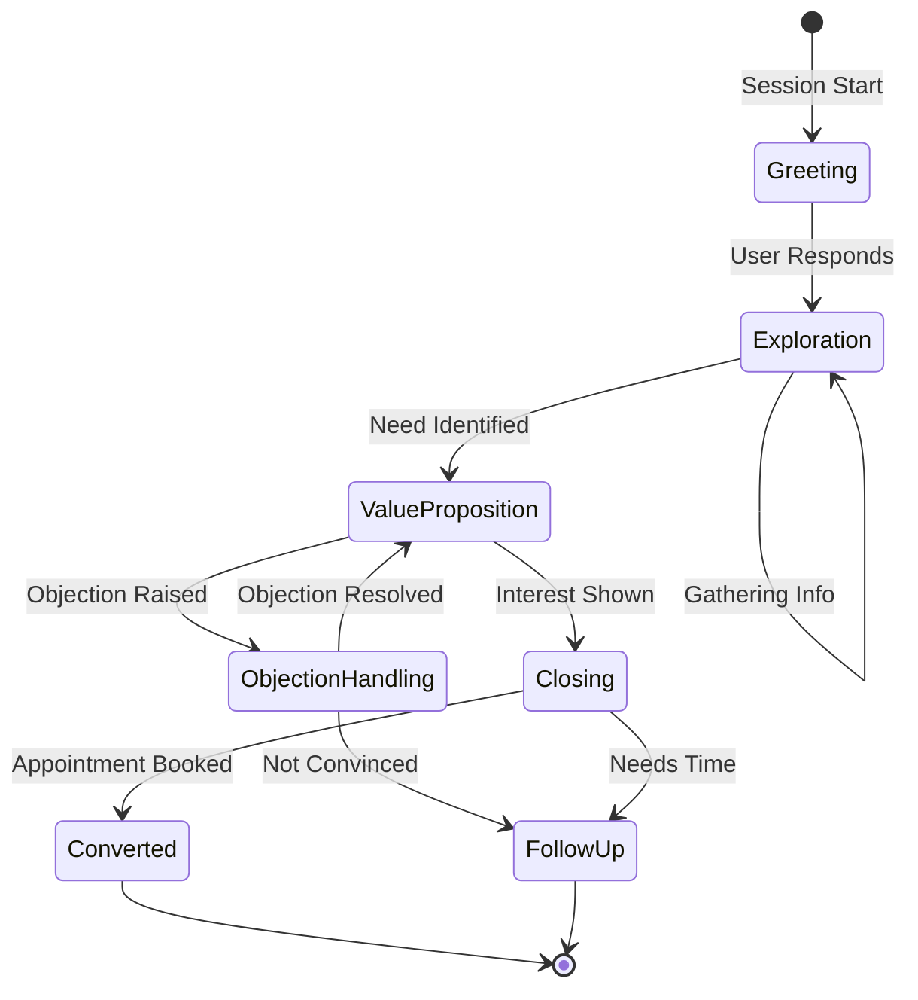

<![CDATA[# voice-agent-agent

> Core conversational agent with dialogue state tracking, memory, and lead scoring

---

## Overview

The `agent` crate is the brain of the voice agent. It orchestrates conversations by:

- **Stage Management** - Guiding conversation flow (greeting → exploration → closing)
- **Dialogue State Tracking (DST)** - Extracting and tracking slot values
- **Hierarchical Memory** - Core → Recall → Archival memory layers
- **Lead Scoring** - Qualifying leads for sales conversion
- **Tool Orchestration** - Executing MCP tools

```
┌─────────────────────────────────────────────────────────────────────────────┐
│                           AGENT ARCHITECTURE                                 │
├─────────────────────────────────────────────────────────────────────────────┤
│                                                                             │
│                         ┌─────────────────────┐                             │
│                         │   GoldLoanAgent     │                             │
│                         │   (Orchestrator)    │                             │
│                         └──────────┬──────────┘                             │
│                                    │                                        │
│         ┌──────────────────────────┼──────────────────────────┐            │
│         │                          │                          │            │
│         ▼                          ▼                          ▼            │
│  ┌─────────────┐          ┌─────────────┐          ┌─────────────┐        │
│  │    Stage    │          │   Memory    │          │     DST     │        │
│  │   Manager   │          │  Agentic    │          │   Tracker   │        │
│  └──────┬──────┘          └──────┬──────┘          └──────┬──────┘        │
│         │                        │                        │                │
│         ▼                        ▼                        ▼                │
│  ┌─────────────┐          ┌─────────────┐          ┌─────────────┐        │
│  │   Stages:   │          │   Memory:   │          │   Slots:    │        │
│  │ • Greeting  │          │ • Core      │          │ • LoanAmt   │        │
│  │ • Explore   │          │ • Recall    │          │ • Purity    │        │
│  │ • Value     │          │ • Archival  │          │ • Phone     │        │
│  │ • Objection │          │             │          │ • Location  │        │
│  │ • Closing   │          │             │          │             │        │
│  └─────────────┘          └─────────────┘          └─────────────┘        │
│                                    │                                        │
│                                    ▼                                        │
│                         ┌─────────────────────┐                             │
│                         │    Lead Scoring     │                             │
│                         │    & Persuasion     │                             │
│                         └─────────────────────┘                             │
│                                                                             │
└─────────────────────────────────────────────────────────────────────────────┘
```

---

## Main Agent

```rust
use voice_agent_agent::{GoldLoanAgent, AgentConfig, AgentEvent};

let agent = GoldLoanAgent::new(AgentConfig {
    llm: llm_backend,
    rag: rag_retriever,
    tools: tool_registry,
    domain_config: domain_config,
})?;

// Process user input
let response_stream = agent.process_stream(
    user_text,
    &session_context,
).await;

while let Some(event) = response_stream.next().await {
    match event {
        AgentEvent::TextChunk(text) => send_to_tts(text),
        AgentEvent::ToolCall(call) => execute_tool(call),
        AgentEvent::StateChange(state) => update_ui(state),
    }
}
```

---

## Conversation Stages



### Stage-Specific Behavior

| Stage | RAG Strategy | Context Budget | Goal |
|-------|--------------|----------------|------|
| **Greeting** | Minimal | 200 tokens | Build rapport |
| **Exploration** | Eager prefetch | 800 tokens | Understand needs |
| **ValueProposition** | Full retrieval | 2000 tokens | Present benefits |
| **ObjectionHandling** | Targeted | 1500 tokens | Address concerns |
| **Closing** | Minimal | 500 tokens | Book appointment |

---

## Dialogue State Tracking (DST)

### Tracked Slots

```rust
pub enum SlotValue {
    LoanAmount(f64),           // ₹5,00,000
    GoldWeight(f64),           // 50 grams
    GoldPurity(GoldPurity),    // 22K
    Phone(String),             // 9876543210
    Location(String),          // Mumbai
    CurrentLender(String),     // Muthoot
    InterestRate(f64),         // 18%
    Urgency(UrgencyLevel),     // High
}

pub enum UrgencyLevel {
    Immediate,  // Need money today
    ThisWeek,   // Within 7 days
    ThisMonth,  // Within 30 days
    Exploring,  // Just checking
}
```

### Slot Extraction

```rust
use voice_agent_agent::dst::{DialogueStateTracker, SlotExtractor};

let dst = DialogueStateTracker::new(DstConfig::default());

// User says: "I have 50 grams of 22 karat gold and need 5 lakh rupees"
let state = dst.update(&user_text, &current_state).await?;

assert_eq!(state.loan_amount, Some(500000.0));
assert_eq!(state.gold_weight, Some(50.0));
assert_eq!(state.gold_purity, Some(GoldPurity::K22));
```

### Confirmation Flow

For critical slots, the agent confirms before proceeding:

```
User: "I need 5 lakh loan"
Agent: "You mentioned you need ₹5 lakh. Is that correct?"
User: "Yes"
Agent: [Slot confirmed, proceed]
```

---

## Hierarchical Memory

```
┌─────────────────────────────────────────────────────────────────────────────┐
│                         MEMORY ARCHITECTURE                                  │
├─────────────────────────────────────────────────────────────────────────────┤
│                                                                             │
│  ┌─────────────────────────────────────────────────────────────────────┐   │
│  │                        CORE MEMORY (500 tokens)                      │   │
│  │                                                                      │   │
│  │  Current turn context, active slot values, immediate state          │   │
│  │                                                                      │   │
│  │  Example:                                                            │   │
│  │  - Customer wants: 5 lakh loan                                       │   │
│  │  - Gold: 50g, 22K purity                                             │   │
│  │  - Current stage: ValueProposition                                   │   │
│  └─────────────────────────────────────────────────────────────────────┘   │
│                                    │                                        │
│                                    ▼                                        │
│  ┌─────────────────────────────────────────────────────────────────────┐   │
│  │                       RECALL MEMORY (1500 tokens)                    │   │
│  │                                                                      │   │
│  │  [Note #1] Customer mentioned they're currently with Muthoot         │   │
│  │            at 18% interest rate                                      │   │
│  │  [Note #2] Customer is a business owner (MSME segment)               │   │
│  │  [Note #3] Customer asked about doorstep service in Mumbai           │   │
│  │  [Note #4] Customer expressed concern about gold safety              │   │
│  │                                                                      │   │
│  └─────────────────────────────────────────────────────────────────────┘   │
│                                    │                                        │
│                                    ▼                                        │
│  ┌─────────────────────────────────────────────────────────────────────┐   │
│  │                      ARCHIVAL MEMORY (500 tokens)                    │   │
│  │                                                                      │   │
│  │  Compressed summary of long conversations:                          │   │
│  │  "High-value MSME customer from Mumbai, currently with Muthoot      │   │
│  │   at 18%. Interested in 5L loan, concerned about safety. Qualified  │   │
│  │   lead, recommend doorstep service and vault security pitch."       │   │
│  │                                                                      │   │
│  └─────────────────────────────────────────────────────────────────────┘   │
│                                                                             │
└─────────────────────────────────────────────────────────────────────────────┘
```

### Memory API

```rust
use voice_agent_agent::memory::{AgenticMemory, MemoryNote};

let memory = AgenticMemory::new(AgenticMemoryConfig::default());

// Add a note
memory.add_note(MemoryNote {
    content: "Customer is currently with Muthoot at 18%".into(),
    importance: 0.9,
});

// Recall relevant memories
let relevant = memory.recall("What lender is the customer with?").await?;

// Get formatted context for LLM
let context = memory.get_context(500)?; // Max 500 tokens
```

---

## Lead Scoring

```rust
use voice_agent_agent::lead_scoring::{LeadScoringEngine, LeadScore};

let scorer = LeadScoringEngine::new(LeadScoringConfig::default());

let score = scorer.score(&dialogue_state, &memory).await?;

println!("Score: {}/100", score.total);
println!("Qualification: {:?}", score.qualification);
println!("Recommended action: {:?}", score.recommendation);
```

### Scoring Components

| Factor | Weight | Signals |
|--------|--------|---------|
| **Intent** | 30% | Loan amount mentioned, urgency expressed |
| **Qualification** | 25% | Gold weight, purity, valid phone |
| **Engagement** | 20% | Response time, questions asked |
| **Pain Points** | 15% | Current lender complaints, high rate |
| **Timing** | 10% | Immediate need vs exploring |

### Lead Qualification Levels

```rust
pub enum LeadQualification {
    Hot,        // Ready to convert, book appointment
    Warm,       // Interested, needs more info
    Cold,       // Just exploring, follow-up later
    Disqualified, // Not eligible or not interested
}
```

---

## Persuasion Engine

```rust
use voice_agent_agent::persuasion::{PersuasionEngine, ObjectionType};

let engine = PersuasionEngine::new(domain_config);

// Handle objection
let response = engine.handle_objection(
    ObjectionType::HighInterestRate,
    &customer_context,
).await?;

// Generate value proposition
let pitch = engine.generate_pitch(
    &customer_segment,
    &competitor_info,
).await?;
```

### Objection Handlers

| Objection | Response Strategy |
|-----------|-------------------|
| "Your rates are high" | Show comparison with competitors |
| "I'm happy with Muthoot" | Highlight savings potential |
| "Switching is hassle" | Explain simple 3-step process |
| "My gold is already pledged" | Offer balance transfer |
| "I'll think about it" | Create urgency with limited offer |

---

## Configuration

```yaml
# config/agent.yaml
agent:
  model: "qwen3:4b-instruct"
  temperature: 0.7
  max_tokens: 200

  persona:
    name: "Priya"
    role: "Gold Loan Advisor"
    language: "en"
    personality: "warm and professional"

  memory:
    core_tokens: 500
    recall_tokens: 1500
    archival_tokens: 500
    compression_threshold: 0.8

  dst:
    confirmation_required: ["loan_amount", "phone"]
    extraction_confidence: 0.8

  lead_scoring:
    hot_threshold: 75
    warm_threshold: 50
```
]]>