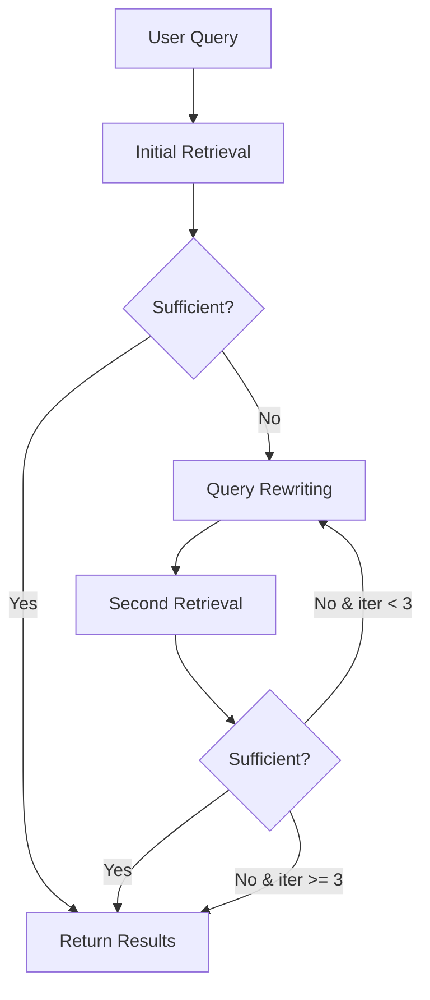

<![CDATA[# voice-agent-rag

> Hybrid RAG with dense + sparse search, reranking, and agentic retrieval

---

## Overview

The `rag` crate provides a production-grade Retrieval-Augmented Generation system:

- **Hybrid Search** - Dense vectors (Qdrant) + Sparse keywords (Tantivy BM25)
- **Cross-Encoder Reranking** - Early-exit for low latency
- **Agentic Retrieval** - Multi-step with sufficiency checking
- **Context Management** - Stage-aware sizing and compression
- **Embedding Cache** - LRU cache for repeated queries

```
┌─────────────────────────────────────────────────────────────────────────────┐
│                            RAG ARCHITECTURE                                  │
├─────────────────────────────────────────────────────────────────────────────┤
│                                                                             │
│  USER QUERY                                                                 │
│      │                                                                      │
│      ▼                                                                      │
│  ┌──────────────────────────────────────────────────────────────────────┐  │
│  │                      QUERY PROCESSING                                 │  │
│  │                                                                       │  │
│  │   ┌─────────────┐   ┌─────────────┐   ┌─────────────┐               │  │
│  │   │   Query     │──▶│ Cross-Lang  │──▶│   Domain    │               │  │
│  │   │  Expansion  │   │ Normalizer  │   │   Boosting  │               │  │
│  │   └─────────────┘   └─────────────┘   └─────────────┘               │  │
│  │                                                                       │  │
│  └──────────────────────────────────────────────────────────────────────┘  │
│                                    │                                        │
│                    ┌───────────────┼───────────────┐                       │
│                    ▼                               ▼                       │
│  ┌────────────────────────────┐   ┌────────────────────────────┐          │
│  │      DENSE SEARCH          │   │      SPARSE SEARCH         │          │
│  │                            │   │                            │          │
│  │  ┌──────────────────────┐  │   │  ┌──────────────────────┐  │          │
│  │  │  E5-Multilingual     │  │   │  │    Tantivy BM25      │  │          │
│  │  │  (384 dims)          │  │   │  │    Full-text         │  │          │
│  │  └──────────────────────┘  │   │  └──────────────────────┘  │          │
│  │           │                │   │           │                │          │
│  │           ▼                │   │           ▼                │          │
│  │  ┌──────────────────────┐  │   │  ┌──────────────────────┐  │          │
│  │  │       Qdrant         │  │   │  │   Tantivy Index      │  │          │
│  │  │   Vector Search      │  │   │  │   Keyword Search     │  │          │
│  │  └──────────────────────┘  │   │  └──────────────────────┘  │          │
│  │                            │   │                            │          │
│  └────────────────────────────┘   └────────────────────────────┘          │
│                    │                               │                       │
│                    └───────────────┬───────────────┘                       │
│                                    ▼                                        │
│  ┌──────────────────────────────────────────────────────────────────────┐  │
│  │                        RRF FUSION                                     │  │
│  │                                                                       │  │
│  │   Reciprocal Rank Fusion: score = Σ 1/(k + rank_i)                   │  │
│  │                                                                       │  │
│  └──────────────────────────────────────────────────────────────────────┘  │
│                                    │                                        │
│                                    ▼                                        │
│  ┌──────────────────────────────────────────────────────────────────────┐  │
│  │                      CROSS-ENCODER RERANKING                          │  │
│  │                                                                       │  │
│  │   ┌─────────────────────────────────────────────────────────────┐    │  │
│  │   │  BGE-Reranker-v2-M3 with PABEE Early Exit                   │    │  │
│  │   │                                                              │    │  │
│  │   │  If score > 0.92: Exit early (2-3.5x speedup)               │    │  │
│  │   └─────────────────────────────────────────────────────────────┘    │  │
│  │                                                                       │  │
│  └──────────────────────────────────────────────────────────────────────┘  │
│                                    │                                        │
│                                    ▼                                        │
│  ┌──────────────────────────────────────────────────────────────────────┐  │
│  │                     CONTEXT MANAGEMENT                                │  │
│  │                                                                       │  │
│  │   ┌─────────────┐   ┌─────────────┐   ┌─────────────┐               │  │
│  │   │   Stage     │──▶│   Context   │──▶│ Compression │               │  │
│  │   │   Budget    │   │   Sizing    │   │   (if req)  │               │  │
│  │   └─────────────┘   └─────────────┘   └─────────────┘               │  │
│  │                                                                       │  │
│  └──────────────────────────────────────────────────────────────────────┘  │
│                                    │                                        │
│                                    ▼                                        │
│                            TOP-K DOCUMENTS                                  │
│                                                                             │
└─────────────────────────────────────────────────────────────────────────────┘
```

---

## Basic Usage

```rust
use voice_agent_rag::{HybridRetriever, RetrieverConfig, RetrieveOptions};

let retriever = HybridRetriever::new(RetrieverConfig {
    qdrant_endpoint: "http://localhost:6333".into(),
    qdrant_collection: "gold_loan_knowledge".into(),
    dense_weight: 0.7,
    sparse_weight: 0.3,
    reranking_enabled: true,
})?;

// Simple retrieval
let docs = retriever.retrieve(
    "What are the interest rates?",
    &RetrieveOptions { top_k: 5, ..default() }
).await?;

for doc in docs {
    println!("{}: {}", doc.title, doc.score);
}
```

---

## Hybrid Search

### Dense Search (Qdrant)

```rust
use voice_agent_rag::embeddings::{CandleBertEmbedder, UnifiedEmbedder};

let embedder = CandleBertEmbedder::new(CandleEmbeddingConfig {
    model_path: "models/embeddings/e5-multilingual".into(),
    quantization: QuantizationMode::FP16,
    pooling: PoolingStrategy::Mean,
})?;

// Generate embeddings
let embedding = embedder.embed("gold loan interest rate").await?;
// Result: [f32; 384]
```

### Sparse Search (Tantivy)

```rust
use voice_agent_rag::sparse_search::SparseIndex;

let index = SparseIndex::new(SparseConfig {
    index_path: "data/tantivy_index".into(),
})?;

// BM25 search
let results = index.search("gold loan eligibility", 20).await?;
```

### RRF Fusion

```rust
use voice_agent_rag::retriever::reciprocal_rank_fusion;

let fused = reciprocal_rank_fusion(
    dense_results,
    sparse_results,
    k: 60.0,  // RRF constant
);
```

---

## Reranking

### Early-Exit Cross-Encoder

```rust
use voice_agent_rag::reranker::{EarlyExitReranker, RerankerConfig};

let reranker = EarlyExitReranker::new(RerankerConfig {
    model_path: "models/reranker/bge-reranker-v2-m3.onnx".into(),
    early_exit_threshold: 0.92,
    early_exit_min_results: 3,
    max_full_model_docs: 10,
})?;

let reranked = reranker.rerank(&query, &documents).await?;
```

### PABEE Early Exit Strategy

```
┌─────────────────────────────────────────────────────────────────────────────┐
│                        EARLY EXIT RERANKING                                  │
├─────────────────────────────────────────────────────────────────────────────┤
│                                                                             │
│  Documents: [D1, D2, D3, D4, D5, D6, D7, D8, D9, D10]                      │
│                                                                             │
│  Step 1: Score D1 → 0.95 > 0.92 ✓ (candidate)                              │
│  Step 2: Score D2 → 0.93 > 0.92 ✓ (candidate)                              │
│  Step 3: Score D3 → 0.91 < 0.92 ✗                                          │
│  Step 4: Score D4 → 0.94 > 0.92 ✓ (candidate)                              │
│                                                                             │
│  3 candidates with score > 0.92 found → EARLY EXIT                         │
│                                                                             │
│  Result: [D1: 0.95, D4: 0.94, D2: 0.93]                                    │
│                                                                             │
│  Speedup: Only 4 docs scored instead of 10 (2.5x faster)                   │
│                                                                             │
└─────────────────────────────────────────────────────────────────────────────┘
```

---

## Agentic Retrieval

Multi-step retrieval with LLM-based sufficiency checking:

```rust
use voice_agent_rag::agentic::{AgenticRetriever, QueryContext};

let agentic = AgenticRetriever::new(AgenticRagConfig {
    max_iterations: 3,
    sufficiency_threshold: 0.8,
    query_rewriting_enabled: true,
})?;

let results = agentic.retrieve_agentic(
    "How do I transfer my gold loan from Muthoot?",
    &QueryContext {
        conversation_stage: ConversationStage::Exploration,
        customer_segment: Some(CustomerSegment::P1HighValue),
        previous_queries: vec![],
    },
).await?;
```

### Agentic Flow



---

## Context Management

### Stage-Aware Budgets

```rust
use voice_agent_rag::context::get_context_budget;

let budget = get_context_budget(&ConversationStage::ValueProposition);
// ContextBudget { max_tokens: 2000, doc_limit: 5, history_turns: 4 }

let budget = get_context_budget(&ConversationStage::Closing);
// ContextBudget { max_tokens: 500, doc_limit: 2, history_turns: 5 }
```

### Context Compression

```rust
use voice_agent_rag::compressor::ContextCompressor;

let compressor = ContextCompressor::new();

let compressed = compressor.compress(
    &documents,
    max_tokens: 500,
).await?;
```

---

## Query Expansion

```rust
use voice_agent_rag::query_expansion::{QueryExpander, QueryExpansionConfig};

let expander = QueryExpander::new(QueryExpansionConfig {
    synonyms_enabled: true,
    domain_terms_enabled: true,
    stopwords: gold_loan_stopwords(),
})?;

// Input: "interest rate"
// Output: ["interest rate", "byaaj dar", "rate of interest", "ROI"]
let expanded = expander.expand("interest rate").await?;
```

---

## Cross-Lingual Support

```rust
use voice_agent_rag::cross_lingual::CrossLingualNormalizer;

let normalizer = CrossLingualNormalizer::new();

// Handles Hindi, Hinglish, and English
let normalized = normalizer.normalize("mujhe gold loan ki rate batao");
// Result: NormalizedQuery {
//   text: "gold loan rate tell",
//   original_script: Devanagari,
//   detected_language: Hindi
// }
```

---

## Embedding Cache

```rust
use voice_agent_rag::cache::{EmbeddingCache, CachedEmbedder};

let cache = EmbeddingCache::new(1000); // LRU cache for 1000 queries
let cached_embedder = CachedEmbedder::new(embedder, cache);

// First call: computes embedding
let emb1 = cached_embedder.embed("interest rate").await?;

// Second call: returns from cache
let emb2 = cached_embedder.embed("interest rate").await?;
// Cache hit!
```

---

## Configuration

```yaml
rag:
  enabled: true

  # Vector store
  qdrant_endpoint: "http://localhost:6333"
  qdrant_collection: "gold_loan_knowledge"
  vector_dim: 384

  # Retrieval
  dense_top_k: 20
  sparse_top_k: 20
  final_top_k: 5
  dense_weight: 0.7
  rrf_k: 60.0
  min_score: 0.4

  # Reranking
  reranking_enabled: true
  prefilter_threshold: 0.15
  max_full_model_docs: 10
  early_termination_threshold: 0.92
  early_termination_min_results: 3

  # Agentic
  query_rewriting_enabled: true
  max_iterations: 3
  sufficiency_threshold: 0.8
```

---

## Latency Breakdown

| Component | Target | Actual | Notes |
|-----------|--------|--------|-------|
| Embedding | 20ms | 18ms | With cache hits: <1ms |
| Dense Search | 15ms | 12ms | Qdrant optimized |
| Sparse Search | 10ms | 8ms | Tantivy in-memory |
| RRF Fusion | 2ms | 1ms | Simple algorithm |
| Reranking | 50ms | 20-50ms | With early exit |
| **Total** | **97ms** | **~70ms** | Typical case |
]]>